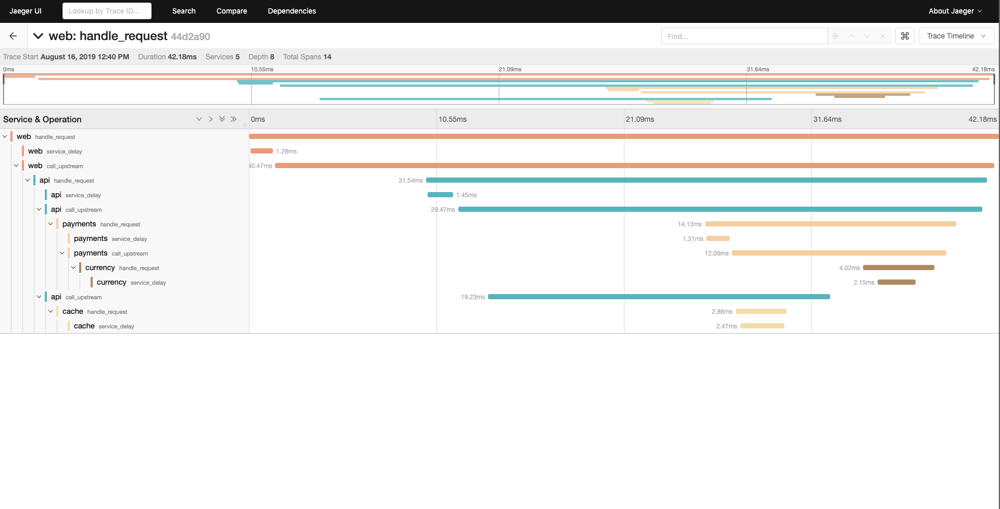
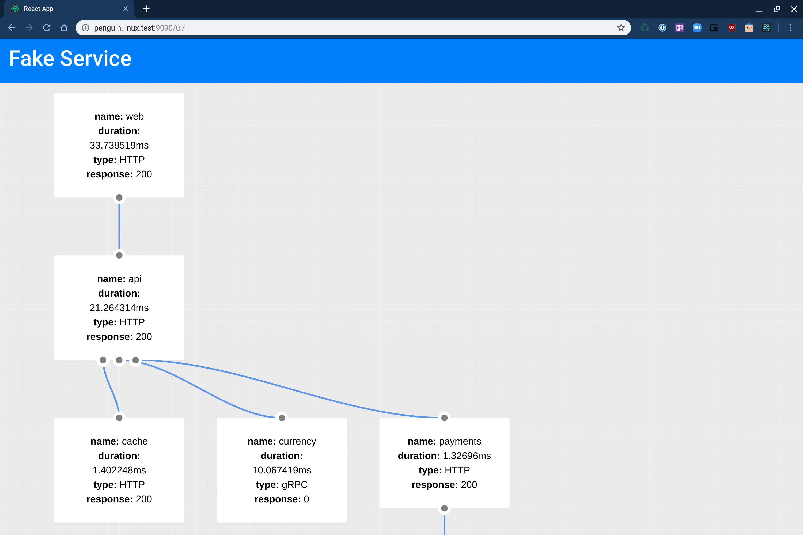
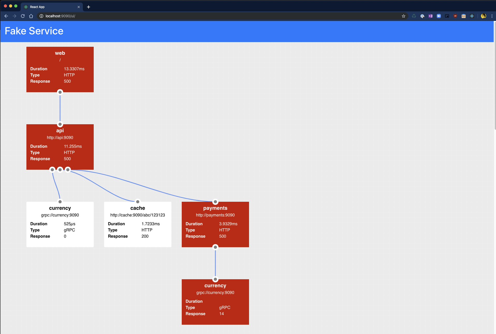

# Fake Service
Fake service that can handle both HTTP and gRPC traffic, for testing upstream service communications and testing service mesh and other scenarios.

Binaries: [https://github.com/nicholasjackson/fake-service/releases/](https://github.com/nicholasjackson/fake-service/releases/)  
Docker Images: [https://hub.docker.com/r/nicholasjackson/fake-service](https://hub.docker.com/r/nicholasjackson/fake-service)  

## Basic usage
To run fake service, first download the correct version for your platform from the releases page. Then run the following command to start the service and bind it to 
all ip addresses on port 19090:

```shell
LISTEN_ADDR=0.0.0.0:19090 fake-service
```

You will see the following output:

```
2021-12-26T14:57:19.222Z [INFO]  Using seed: seed=1640530639
2021-12-26T14:57:19.222Z [INFO]  Adding handler for UI static files
2021-12-26T14:57:19.223Z [INFO]  Settings CORS options: allow_creds=false allow_headers=Accept,Accept-Language,Content-Language,Origin,Content-Type allow_origins=*
2021-12-26T14:57:19.223Z [INFO]  Started service: name=Code upstreamURIs= upstreamWorkers=1 listenAddress=0.0.0.0:19090
```

Next let's try to connect to the service using the curl:

```shell
curl localhost:19090
```

Fake service will respond with a json payload similar to the following:

```shell
{
  "name": "Code",
  "uri": "/",
  "type": "HTTP",
  "ip_addresses": [
    "172.21.166.161"
  ],
  "start_time": "2021-12-26T14:58:47.248837",
  "end_time": "2021-12-26T14:58:47.249039",
  "duration": "202.008µs",
  "body": "Hello World",
  "code": 200
}
```

You could have also made this request using the browser based ui that is available at the following url: http://localhost:19090/ui

Let's now see how you can make a gRPC request to fake service using [gRPCurl](https://github.com/fullstorydev/grpcurl)

```shell
 grpcurl -plaintext localhost:19090 FakeService.Handle
{
  "Message": "{\n  \"name\": \"Code\",\n  \"type\": \"gRPC\",\n  \"ip_addresses\": [\n    \"172.21.166.161\"\n  ],\n  \"start_time\": \"2021-12-26T15:03:27.384751\",\n  \"end_time\": \"2021-12-26T15:03:27.384805\",\n  \"duration\": \"53.961µs\",\n  \"body\": \"Hello World\",\n  \"code\": 0\n}\n"
}
```

The gRPC endpoint returns a message with a single parameter that contains the same json payload that was returned by the HTTP endpoint. You can use `jq` to extract this message using the folowing command:

```shell
➜ grpcurl -plaintext localhost:19090 FakeService.Handle | jq -r .Message
{
  "name": "Code",
  "type": "gRPC",
  "ip_addresses": [
    "172.21.166.161"
  ],
  "start_time": "2021-12-26T15:05:30.281199",
  "end_time": "2021-12-26T15:05:30.281257",
  "duration": "57.889µs",
  "body": "Hello World",
  "code": 0
}
```

There are a many more advance use cases from linking multiple services together or controlling the response duration or error threshold. These options 
can be set using environment variables. 

## Configuration
Configuration values for fake service are set using environment variables, the following is a full list of permissable options:

```
Configuration values are set using environment variables, for info please see the following list:

Environment variables:
  UPSTREAM_URIS  default: no default
       Comma separated URIs of the upstream services to call
  UPSTREAM_WORKERS  default: '1'
       Number of parallel workers for calling upstream services, default is 1 which is sequential operation
  UPSTREAM_REQUEST_BODY  default: no default
       Request body to send to send with upstream requests, NOTE: UPSTREAM_REQUEST_SIZE and UPSTREAM_REQUEST_VARIANCE are ignored if this is set
  UPSTREAM_REQUEST_SIZE  default: '0'
       Size of the randomly generated request body to send with upstream requests
  UPSTREAM_REQUEST_VARIANCE  default: '0'
       Percentage variance of the randomly generated request body
  MESSAGE  default: 'Hello World'
       Message to be returned from service, can either be a string or valid JSON
  NAME  default: 'Service'
       Name of the service
  LISTEN_ADDR  default: '0.0.0.0:9090'
       IP address and port to bind service to
  ALLOWED_ORIGINS  default: '*'
       Comma separated list of allowed origins for CORS requests
  ALLOWED_HEADERS  default: 'Accept,Accept-Language,Content-Language,Origin,Content-Type'
       Comma separated list of allowed headers for CORS requests
  ALLOW_CREDENTIALS  default: 'false'
       Are credentials allowed for CORS requests
  HTTP_SERVER_KEEP_ALIVES  default: 'false'
       Enables the HTTP servers handling of keep alives.
  HTTP_SERVER_READ_TIMEOUT  default: '5s'
       Maximum duration for reading an entire HTTP request, if zero no read timeout is used.
  HTTP_SERVER_READHEADER_TIMEOUT  default: '0s'
       Maximum duration for reading the HTTP headers, if zero read timeout is used.
  HTTP_SERVER_WRITE_TIMEOUT  default: '10s'
       Maximum duration for writing HTTP body, if zero no write timeout is used.
  HTTP_SERVER_IDLE_TIMEOUT  default: '30s'
       Maximum duration to wait for next request when HTTP Keep alives are used.
  HTTP_CLIENT_KEEP_ALIVES  default: 'false'
       Enable HTTP connection keep alives for upstream calls
  HTTP_CLIENT_REQUEST_TIMEOUT  default: '30s'
       Maximum duration for upstream service requests
  HTTP_CLIENT_APPEND_REQUEST  default: 'true'
       When true the path, querystring, and any headers sent to the service will be appended to any upstream calls
  TIMING_50_PERCENTILE  default: '0s'
       Median duration for a request
  TIMING_90_PERCENTILE  default: '0s'
       90 percentile duration for a request, if no value is set, will use value from TIMING_50_PERCENTILE
  TIMING_99_PERCENTILE  default: '0s'
       99 percentile duration for a request, if no value is set, will use value from TIMING_90_PERCENTILE
  TIMING_VARIANCE  default: '0'
       Percentage variance for each request, every request will vary by a random amount to a maximum of a percentage of the total request time
  ERROR_RATE  default: '0'
       Decimal percentage of request where handler will report an error. e.g. 0.1 = 10% of all requests will result in an error
  ERROR_TYPE  default: 'http_error'
       Type of error [http_error, delay]
  ERROR_CODE  default: '500'
       Error code to return on error
  ERROR_DELAY  default: '0s'
       Error delay [1s,100ms]
  RATE_LIMIT  default: '0'
       Rate in req/second after which service will return an error code
  RATE_LIMIT_CODE  default: '503'
       Code to return when service call is rate limited
  LOAD_CPU_CLOCK_SPEED  default: '1000'
       MHz of a single logical core, default 1000Mhz
  LOAD_CPU_CORES  default: '-1'
       Number of logical cores to generate fake CPU load over, by default fake-service will use all cores
  LOAD_CPU_PERCENTAGE  default: '0'
       Percentage of CPU cores to consume as a percentage. I.e: 50, 50% load for LOAD_CPU_CORES. If LOAD_CPU_ALLOCATED 
       is not specified CPU percentage is based on the Total CPU available
  LOAD_MEMORY_PER_REQUEST  default: '0'
       Memory in bytes consumed per request
  LOAD_MEMORY_VARIANCE  default: '0'
       Percentage variance of the memory consumed per request, i.e with a value of 50 = 50%, and given a LOAD_MEMORY_PER_REQUEST of 1024 bytes, actual consumption per request would be in the range 516 - 1540 bytes
  TRACING_ZIPKIN  default: no default
       Location of Zipkin tracing collector
  TRACING_DATADOG_HOST  default: no default
       Hostname or IP for Datadog tracing collector
  TRACING_DATADOG_PORT  default: '8126'
       Port for Datadog tracing collector
  METRICS_DATADOG_HOST  default: no default
       Hostname or IP for Datadog metrics collector
  METRICS_DATADOG_PORT  default: '8125'
       Port for Datadog metrics collector
  LOG_FORMAT  default: 'text'
       Log file format. [text|json]
  LOG_LEVEL  default: 'info'
       Log level for output. [info|debug|trace|warn|error]
  LOG_OUTPUT  default: 'stdout'
       Location to write log output, default is stdout, e.g. /var/log/web.log
  TLS_CERT_LOCATION  default: no default
       Location of PEM encoded x.509 certificate for securing server
  TLS_KEY_LOCATION  default: no default
       Location of PEM encoded private key for securing server
  HEALTH_CHECK_RESPONSE_CODE  default: '200'
       Response code returned from the HTTP health check at /health
  READY_CHECK_RESPONSE_SUCCESS_CODE  default: '200'
       Response code returned from the HTTP readiness handler `/ready` after the response delay has elapsed
  READY_CHECK_RESPONSE_FAILURE_CODE  default: '503'
       Response code returned from the HTTP readiness handler `/ready` before the response delay has elapsed, this simulates the response code a service would return while starting
  READY_CHECK_ROOT_PATH_WAIT_TILL_READY  default: 'false'
       Should the main handler at path `/` or the gRPC method `FakeService` wait for the readiness check to pass before returning a response?
  READY_CHECK_RESPONSE_DELAY  default: '0s'
       Delay before the readyness check returns the READY_CHECK_RESPONSE_CODE
  RAND_SEED  default: '1637512822'
       A seed to initialize the random number generators
```

## Tracing
When the `TRACING_ZIPKIN` environment variable is configured to point to a Zipkin compatible collector, Fake Service, will output
traces using the OpenTracing library. These can be viewed Jaeger Tracing or other tools which support OpenTracing.



## Examples

### Docker Compose - examples/docker-compose
This example shows a multi-tier system running in docker compose consisting of 4 services which emit tracing data to Jaeger Tracing.

```
web - type HTTP
  |-- api (upstream calls to payments and cache in parallel) - type gRPC
      |-- payments - type HTTP
      |   |-- currency - type HTTP
      |-- cache - type HTTP
```

To run the example:
```
$ cd examples/docker-compose
$ docker-compose up
Starting docker-compose_currency_1 ... done
Starting docker-compose_cache_1    ... done
Starting docker-compose_api_1      ... done
Starting docker-compose_payments_1 ... done
Starting docker-compose_jaeger_1   ... done
Starting docker-compose_web_1      ... done
Attaching to docker-compose_payments_1, docker-compose_api_1, docker-compose_cache_1, docker-compose_web_1, docker-compose_currency_1, docker-compose_jaeger_1
payments_1  | 2019-08-16T12:15:01.362Z [INFO]  Starting service: name=payments message="Payments response" upstreamURIs=http://currency:9090 upstreamWorkers=1 listenAddress=0.0.0.0:9090 http_client_keep_alives=false zipkin_endpoint=http://jaeger:9411
cache_1     | 2019-08-16T12:15:01.439Z [INFO]  Starting service: name=cache message="Cache response" upstreamURIs= upstreamWorkers=1 listenAddress=0.0.0.0:9090 http_client_keep_alives=false zipkin_endpoint=http://jaeger:9411
```

Then curl the HTTP endpoint:
```
➜ curl -s localhost:9090 | jq
{
  "name": "web",
  "type": "HTTP",
  "duration": "25.4975ms",
  "body": "Hello World",
  "upstream_calls": [
    {
      "name": "api",
      "uri": "grpc://api:9090",
      "type": "gRPC",
      "duration": "20.8857ms",
      "body": "API response",
      "upstream_calls": [
        {
          "name": "payments",
          "uri": "http://payments:9090",
          "type": "HTTP",
          "duration": "8.462ms",
          "body": "Payments response",
          "upstream_calls": [
            {
              "name": "currency",
              "uri": "http://currency:9090/12434/jackson?auth=true",
              "type": "HTTP",
              "duration": "224.9µs",
              "body": "Currency response"
            }
          ]
        },
        {
          "name": "cache",
          "uri": "http://cache:9090",
          "type": "HTTP",
          "duration": "500.5µs",
          "body": "Cache response"
        }
      ]
    }
  ]
}
```


Tracing data can be seen using Jaeger which is running at `http://localhost:16686`.

## Error Injection
Fake Service has the capability to simulate service errors, this feature can be used to test reliability patterns, particularly those which are externailized in a service mesh. The errors which Fake Service can simulate are:

* Service Errors - gRPC and HTTP responses
* Service Delays - Simulate sporadic delays to service execution
* Rate Limiting - Simulate rate limiting of a service

Error Injection can be configured using the following environment variables:

```
  ERROR_RATE  default: '0'
       Decimal percentage of request where handler will report an error. e.g. 0.1 = 10% of all requests will result in an error
  ERROR_TYPE  default: 'http_error'
       Type of error [http_error, delay]
  ERROR_CODE  default: '500'
       Error code to return on error
  ERROR_DELAY  default: '0s'
       Error delay [1s,100ms]
  RATE_LIMIT  default: '0'
       Rate in req/second after which service will return an error code
  RATE_LIMIT_CODE  default: '503'
       Code to return when service call is rate limited
```

All features for Error Injection are available for HTTP and gRPC services.

**NOTE:** gRPC calls do not return a message when an error is returned

### Service Errors
To simulate a HTTP service which returns an Internal Server Error (Status Code 500) error 20% of the time, the following command can be used:

```
$ ERROR_RATE=0.2 ERROR_TYPE=http_error ERROR_CODE=500 fake-service
```

When called Fake Service will return an error 500 for every 2/10 requests:

```
➜ curl -i localhost:9090
HTTP/1.1 500 Internal Server Error
Date: Wed, 25 Sep 2019 09:36:45 GMT
Content-Length: 129
Content-Type: text/plain; charset=utf-8

{
  "name": "web",
  "type": "HTTP",
  "body": "Hello World",
  "code": 500,
  "error": "Service error automatically injected"
}
```

To simulate a gRPC service with the same error response, the following example can be used:

```
$ ERROR_RATE=0.2 ERROR_TYPE=http_error ERROR_CODE=13 SERVER_TYPE=grpc fake-service
```

### Service Delays
Service Delays give more granular control over the time take for a service to respond and can be used in combination with Service Timing. To simulate a execution delay which would result in a client timeout 20% of the time, the following command can be used:

```
$ ERROR_RATE=0.2 ERROR_TYPE=delay ERROR_DELAY=2m  fake-service

➜ curl -i --max-time 0.5 localhost:9090
curl: (28) Operation timed out after 505 milliseconds with 0 bytes received
```

### Rate Limiting
It is possible to configure Fake Service to rate limit calls, rate limiting is applied before Service Errors or Service Delays and can be used in combination with these features. To simulate a service which only allows a rate of 1 request per second, the following example can be used:

```
$ RATE_LIMIT=1 RATE_LIMIT_CODE=429 fake-service
```

When the service is called quickly in succession the second calls with a rate limit error message:

```
➜ curl -i --max-time 0.5 localhost:9090
HTTP/1.1 200 OK
Date: Wed, 25 Sep 2019 09:59:01 GMT
Content-Length: 109
Content-Type: text/plain; charset=utf-8

{
  "name": "Service",
  "type": "HTTP",
  "duration": "21.512µs",
  "body": "Hello World",
  "code": 200
}

➜ curl -i --max-time 0.5 localhost:9090
HTTP/1.1 429 Too Many Requests
Date: Wed, 25 Sep 2019 09:59:02 GMT
Content-Length: 124
Content-Type: text/plain; charset=utf-8

{
  "name": "Service",
  "type": "HTTP",
  "body": "Hello World",
  "code": 429,
  "error": "Service exceeded rate limit"
}
```

### Service Load
Fake Service can simulate load carried out during a service call by configuring the following variables.
```
  LOAD_CPU_CORES  default: '0'
       Number of cores to generate fake CPU load over
  LOAD_CPU_PERCENTAGE  default: '0'
       Percentage of CPU cores to consume as a percentage. I.e: 50, 50% load for LOAD_CPU_CORES
  LOAD_MEMORY_PER_REQUEST  default: '0'
       Memory in bytes consumed per request
  LOAD_MEMORY_VARIANCE  default: '0'
       Percentage variance of the memory consumed per request, i.e with a value of 50 = 50%, and given a LOAD_MEMORY_PER_REQUEST of 1024 bytes, actual consumption per request would be in the range 516 - 1540 bytes
```

For example to simulate a service call consuming 100% of 8 Cores you can run fake service with the following command:

```
LOAD_CPU_CORES=8 LOAD_CPU_PERCENTAGE=100 fake-service
```

To simulate each service call consuming between 50MB and 150MB of memory

```
LOAD_MEMORY_PER_REQUEST=104857600 LOAD_MEMORY_VARIANCE=50 fake-service
```

### Health checks

Fake service implements both health checks and readyness checks. By default these are both configured to return a status 200 when called.

* Readyness check path: "/ready"
* Health check path: "/health"

To override the behaviour of the health check or the readyness checks the following environment varaibles can be set.

```
  HEALTH_CHECK_RESPONSE_CODE  default: '200'
       Response code returned from the HTTP health check at /health
  READY_CHECK_RESPONSE_SUCCESS_CODE  default: '200'
       Response code returned from the HTTP readiness handler `/ready` after the response delay has elapsed
  READY_CHECK_RESPONSE_FAILURE_CODE  default: '503'
       Response code returned from the HTTP readiness handler `/ready` before the response delay has elapsed, this simulates the response code a service would return while starting
  READY_CHECK_RESPONSE_DELAY  default: '0s'
       Delay before the readyness check returns the READY_CHECK_RESPONSE_CODE
```

## UI
Fake Service also has a handy dandy UI which can be used to graphically represent the data which is returned as JSON when curling.

The API is accessible at the path `/ui` and under the covers just calls the main API endpoint.

**NOTE:** The UI is only available when a service is configured as `HTTP`.

### Example UI


### Example UI with errors

