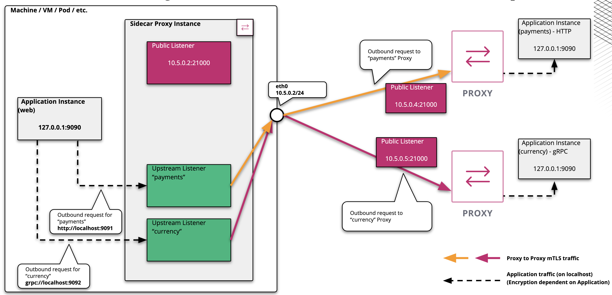

## Frontend to gRPC and HTTP upstreams
This demo provides a Consul connect example based on a HTTP client and two upstream services: one using gRPC and one using regular REST API. Below is a diagram.



### Description
The frontend service `web` is configured to connect to an HTTP service called `payments` and a gRPC service called `currency`. These two upstreams are configured in the [service_config/web_v1.hcl](service_config/web_v1.hcl) file as follows.
```
        upstreams = [{
          destination_name = "payments"
          local_bind_address = "127.0.0.1"
          local_bind_port = 9091
        },{
          destination_name = "currency"
          local_bind_address = "127.0.0.1"
          local_bind_port = 9092
        }
	]
```

The web service itself will communicate to its local proxy on the above two ports as configured via the `UPSTREAM_URIS` variable in docker-compose.yaml:
```
      UPSTREAM_URIS: "http://localhost:9091, grpc://localhost:9092"
```

#### gRPC
The `currency` service is configured to open a gRPC listener via the `SERVER_TYPE` environment variable:
```
  currency_v1:
    image: nicholasjackson/fake-service:v0.10.0
    environment:
      LISTEN_ADDR: localhost:9090
      NAME: currency-v1
      MESSAGE: "Currency"
      SERVER_TYPE: "grpc"
```

### Deploying
Run the following commands from a terminal
```
docker-compose up

# Once all services are up run the following commands
export CONSUL_HTTP_ADDR=http://127.0.0.1:38500
consul catalog services -tags
curl http://127.0.0.1:38500/v1/agent/checks
```

Open up a browser to localhost:38500 to view the Consul UI. Navigate to services and ensure all health checks are passing.

### Interact with the web service
```
$ curl http://localhost:39090/
{
  "name": "web",
  "type": "HTTP",
  "duration": "23.70744ms",
  "body": "Hello World",
  "upstream_calls": [
    {
      "name": "payments-v1",
      "uri": "http://localhost:9091",
      "type": "HTTP",
      "duration": "16.89µs",
      "body": "Payments"
    },
    {
      "name": "currency-v1",
      "uri": "grpc://localhost:9092",
      "type": "gRPC",
      "duration": "24.167µs",
      "body": "Currency"
    }
  ]
}
```

To see the Envoy proxy localhost listeners, run the following command:
```
$ curl http://localhost:39005/listeners
public_listener:10.5.0.3:20000::10.5.0.3:20000
payments:127.0.0.1:9091::127.0.0.1:9091
currency:127.0.0.1:9092::127.0.0.1:9092
```

### Intentions
Go to the Intentions tab on the Consul UI and create a `*` `*` deny rule. Now invoke the web service again and you should see it fail.
```
curl http://localhost:39090
```

Now create a `web` to `payments` allow rule, and a `web` to `currency` allow rule. Now invoke the web service again and you should see it work again: `curl http://localhost:39090`.
 
To create the intentions in the CLI you can use the commands below
```
consul intention create -deny '* '*'
consul intention create -allow 'web' 'payments'
consul intention create -allow 'web' 'currency'
```


### Clean up
Hit Ctrl-C on the terminal with Docker compose. Once everything is turned off, run `docker-compose stop`
