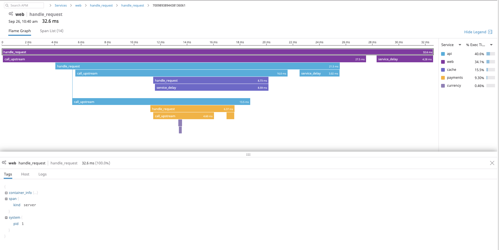

# Fake Service with DataDog metrics and tracing
This example shows how Fake Service can be used to report data to DataDog. The setup consists of the following services and heirachy.

```
web (HTTP) --
               api (HTTP) --
                            payments (HTTP)
                                            -- currency (gRPC 50% error rate)
                            cache (HTTP)
```

## Running the example
The example requires a valid DataDog API key, you can obtain this by signing up for an account at (https://app.datadoghq.com). Once you have
a DataDog API key this must be set as an environment variable so that the datadog-agent can communicate with the API.

```
export DD_API_KEY=my_key
```

The example can then be started using Docker Compose

```
docker-compose up

Starting docker-compose-datadog_cache_1         ... done
Starting docker-compose-datadog_web_1           ... done
Starting docker-compose-datadog_datadog-agent_1 ... done
Starting docker-compose-datadog_api_1           ... done
Starting docker-compose-datadog_currency_1      ... done
Starting docker-compose-datadog_payments_1      ... done
Attaching to docker-compose-datadog_cache_1, docker-compose-datadog_payments_1, docker-compose-datadog_datadog-agent_1, docker-compose-datadog_currency_1, docker-compose-datadog_api_1, docker-compose-datadog_web_1
cache_1          | 2019-09-26T09:46:31.155Z [INFO]  Starting service: name=cache message="Cache response" upstreamURIs= upstreamWorkers=1 listenAddress=0.0.0.0:9090 http_client_keep_alives=true http_append_request=true service type=http zipkin_endpoint=
payments_1       | 2019-09-26T09:46:31.208Z [INFO]  Starting service: name=payments message="Payments response" upstreamURIs=grpc://currency:9090 upstreamWorkers=1 listenAddress=0.0.0.0:9090 http_client_keep_alives=true http_append_request=true service type=http zipkin_endpoint=
api_1            | 2019-09-26T09:46:31.548Z [INFO]  Starting service: name=api message="API response" upstreamURIs="http://payments:9090/12434/jackson?auth=true, http://cache:9090" upstreamWorkers=2 listenAddress=0.0.0.0:9090 http_client_keep_alives=true http_append_request=true service type=http zipkin_endpoint=
currency_1       | 2019-09-26T09:46:31.480Z [INFO]  Starting service: name=currency message="Currency response" upstreamURIs= upstreamWorkers=1 listenAddress=0.0.0.0:9090 http_client_keep_alives=true http_append_request=true service type=grpc zipkin_endpoint=
datadog-agent_1  | [s6-init] making user provided files available at /var/run/s6/etc...exited 0.
web_1            | 2019-09-26T09:46:31.622Z [INFO]  Starting service: name=web message="Hello World" upstreamURIs=http://api:9090 upstreamWorkers=1 listenAddress=0.0.0.0:9090 http_client_keep_alives=true http_append_request=true service type=http zipkin_endpoint=
datadog-agent_1  | [s6-init] ensuring user provided files have correct perms...exited 0.
datadog-agent_1  | [fix-attrs.d] applying ownership & permissions fixes...
datadog-agent_1  | [fix-attrs.d] done.
datadog-agent_1  | [cont-init.d] executing container initialization scripts...
```

The initial `web` service can be accessed at port 9090, to test the system curl this endpoint. `currency` has been configured to return a `500` error every second call.

```
➜ curl localhost:9090
{
  "name": "web",
  "type": "HTTP",
  "duration": "32.6956ms",
  "body": "Hello World",
  "upstream_calls": [
    {
      "name": "api",
      "uri": "http://api:9090",
      "type": "HTTP",
      "duration": "21.2637ms",
      "body": "API response",
      "upstream_calls": [
        {
          "name": "cache",
          "uri": "http://cache:9090",
          "type": "HTTP",
          "duration": "1.5345ms",
          "body": "Cache response",
          "code": 200
        },
        {
          "name": "payments",
          "uri": "http://payments:9090/12434/jackson?auth=true",
          "type": "HTTP",
          "duration": "6.9006ms",
          "body": "Payments response",
          "upstream_calls": [
            {
              "name": "currency",
              "uri": "grpc://currency:9090",
              "type": "gRPC",
              "duration": "398.4µs",
              "body": "Currency response",
              "code": 0
            }
          ],
          "code": 200
        }
      ],
      "code": 200
    }
  ],
  "code": 200
}

➜ curl localhost:9090
{
  "name": "web",
  "type": "HTTP",
  "duration": "12.9277ms",
  "body": "Hello World",
  "upstream_calls": [
    {
      "name": "api",
      "uri": "http://api:9090",
      "type": "HTTP",
      "duration": "8.03ms",
      "body": "API response",
      "upstream_calls": [
        {
          "name": "cache",
          "uri": "http://cache:9090",
          "type": "HTTP",
          "duration": "1.5539ms",
          "body": "Cache response",
          "code": 200
        },
        {
          "name": "payments",
          "uri": "http://payments:9090/12434/jackson?auth=true",
          "type": "HTTP",
          "duration": "6.2867ms",
          "body": "Payments response",
          "upstream_calls": [
            {
              "uri": "grpc://currency:9090",
              "code": 500,
              "error": "rpc error: code = Code(500) desc = Service error automatically injected"
            }
          ],
          "code": 500,
          "error": "Error processing upstream request: http://payments:9090/12434/jackson/?auth=true"
        }
      ],
      "code": 500,
      "error": "Error processing upstream request: http://api:9090/"
    }
  ],
  "code": 500
}
```

## Viewing output
The traces output from the system can be viewed in the DataDog APM browser:



## Consul Service Mesh
To run this example including Consul Service Mesh the following command can be used:

```
docker-compose -f docker-compose-consul.yml up
```
